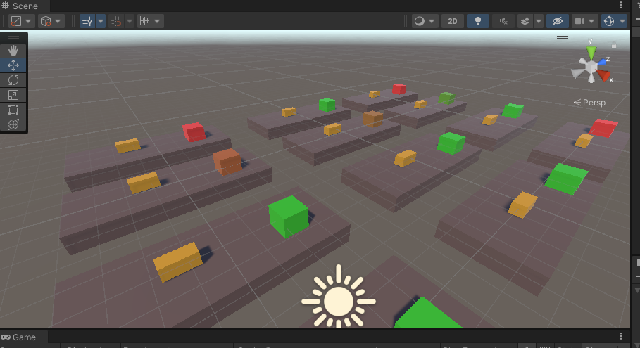

# ml-agents

Ejemplo con comentarios para ml-agents.

El entorno virtual no está subido, si queremos entrenar nosotros la IA: [Pasos para entrenar a la IA](https://github.com/videojuegos-abastos/PRIA/blob/main/te/t5_ml_agents.md#pasos-a-seguir-para-utilizar-ml-agents).

## Entorno

El objetivo de la IA es no tocar el obstáculo (el cubo que avanza hacia el agente) pero manteniéndose lo más cerca posible del centro del entorno.

  

